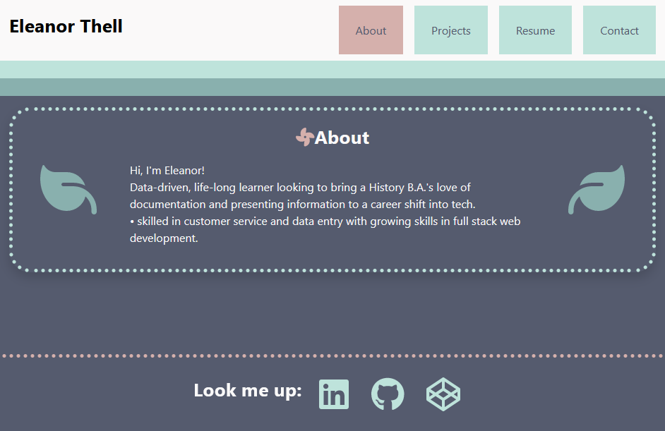

# React Portfolio

## Description

This app is a portfolio using React, which helps set it apart from other developers whose portfolios don’t use the latest technologies.

## Installation

N/A

## Usage

Preview:

Live link [here](https://react-portfolio-560a58.netlify.app/)

## Credits

Using FontAwesome with React: https://fontawesome.com/docs/web/use-with/react/

Troubleshooting Bootstrap with React: https://stackoverflow.com/questions/47354472/react-bootstrap-not-styling-my-react-components

## License

N/A
